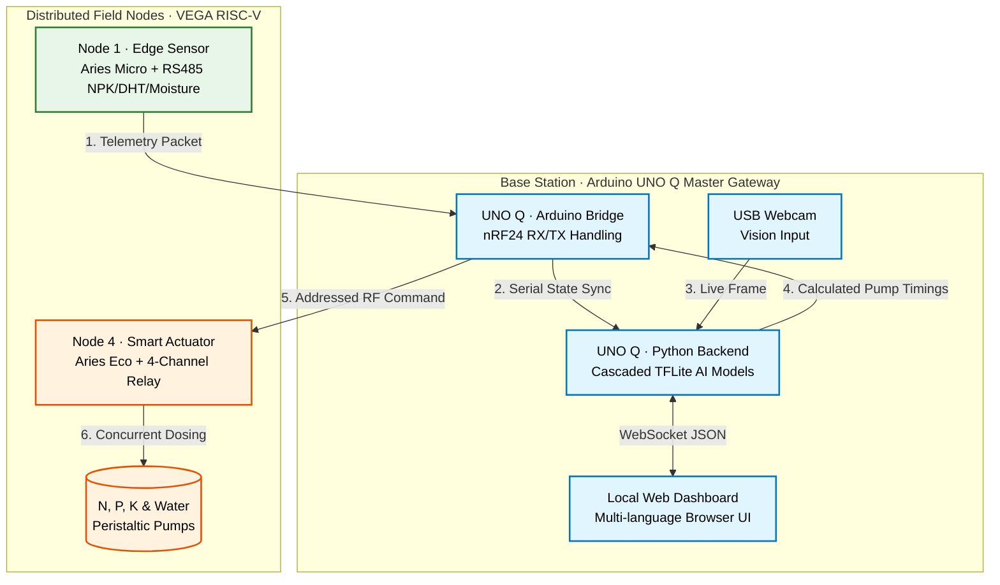

# SICHAI-Vision: Affordable Offline AI for Precision Farming

[]()
[]()
[]()
[]()
[]()

> **Arduino Physical AI Challenge India 2026 · Team IrriGreat · APC-2026-UP-13486**
> *Jaypee Institute of Information Technology, Noida*

**SICHAI-Vision** is a distributed, 100% offline edge-AI platform designed to bring enterprise-grade precision agriculture to smallholder farmers and Farmer Producer Organizations (FPOs) in India.

By fusing indigenous VEGA RISC-V telemetry nodes with the on-device AI compute of the **Arduino UNO Q**, SICHAI-Vision identifies crops, diagnoses plant diseases in real-time, calculates exact ICAR-STCR nutrient deficits, and autonomously commands field actuators to dispense precise liquid fertilizer — all without requiring cloud subscriptions, SIM cards, or internet connectivity.

**Images:** [Drive](https://drive.google.com/drive/folders/1SuTV5CN6S-XfJwex8HMwZb7yy1i1WdUb?view=grid)
**Field Deployment:** 30-day autonomous pilot on JIIT Noida campus (Aug 2026)

---

## The Problem

Precision agriculture reduces input costs and improves yields, but remains inaccessible to those who need it most.

- Indian smallholder farmers waste an estimated **₹40,000 crore annually** on uniform fertilizer application
- Existing precision-ag systems cost **₹2.5 lakh+** upfront
- They require **rural cellular data plans** and **cloud subscriptions**
- **98% of Indian farms** are priced out entirely

## Our Solution

SICHAI-Vision slashes the 5-year Total Cost of Ownership by **~88%** — from ₹3.4 lakh down to ₹40,000 — by shifting all intelligence to the edge. A single Arduino UNO Q master node runs vision AI, dosing logic, and mesh coordination, orchestrating a network of low-power indigenous RISC-V sensor and actuator nodes deployed across the field.

| | Imported System | SICHAI-Vision |
|---|---|---|
| Hardware (5-node kit) | ₹2,50,000+ | ₹35,000 |
| Cloud subscription | ₹15,000/year | ₹0 |
| SIM data plan | ₹3,000/year | ₹0 |
| 5-year TCO | ~₹3,40,000 | **~₹40,000** |

---

## Multi-Nodal System Architecture

SICHAI-Vision operates on a decoupled Master/Sub-node topology, communicating over a localized nRF24L01+ 2.4 GHz mesh network.



## The Nodes

SICHAI-Vision distributes workloads across specialized hardware nodes to maximize efficiency and minimize power consumption:

### Node 1: Edge Sensor (VEGA Aries Micro)
- Sleeps in ultra-low power mode to conserve battery
- Wakes periodically, powers a localized hardware gate to boot sensors (RS485 NPK, capacitive moisture, DHT11, LDR)
- Transmits telemetry to the Master Gateway and immediately returns to sleep

### Node 2 & 3: Master Gateway & AI Server (Arduino UNO Q)
- **Node 2 (Firmware):** Uses `Arduino_RouterBridge` to manage nRF24 mesh traffic. Handles AutoACK delivery and dynamic payload resizing.
- **Node 3 (Linux/Python):** Runs the local web UI, grabs USB camera frames, executes INT8-quantized TensorFlow Lite models, and computes ICAR-STCR fertilization logic.

### Node 4: Smart Actuator (VEGA Aries Eco)
- Listens continuously on address `ACT01`
- Receives dosing timing commands from the Master Gateway
- Uses non-blocking `millis()` timers to independently and concurrently dispense exact millilitres of Nitrogen, Phosphorus, Potassium, and Water

---

## Cascaded Edge-AI Pipeline

Running monolithic AI models on the edge drains resources. SICHAI-Vision uses a **cascaded gating architecture** that processes frames at **10+ FPS natively** on the Arduino UNO Q CPU via XNNPACK.

### Gate 1: Crop Classification (Model 1)
Quantized MobileNetV2 (α=0.75, INT8) trained on **6 classes**: Tomato, Potato, Maize, Rice, Wheat, and Background_Not_Crop.
- **Confidence gate:** ≥ 0.80 to advance to Model 3

### Gate 2: Plant Health & Disease Detection (Model 3)
Specialized binary classifier: `Healthy_Foliage` vs `Diseased_Foliage`.
- **Confidence gate:** ≥ 0.70
- **Safety interlock:** If diseased, system aborts fertigation and triggers UI alert — prevents chemical burn on sick roots

### Stage 3: ICAR-STCR Expert System (Model 2)
Deterministic rule-based dosing engine (intentionally not ML — chemical dispensing requires audit-able logic).
- Fuses detected crop with real-time RS485 soil telemetry
- Calculates exact mg/kg nutrient deficit from ICAR reference tables
- Converts deficit to hardware pump seconds via measured flow rates
- Hard safety cap: 10 seconds max per pump

### Stage 4: Sensor Calibration (Model 4)
2nd-degree polynomial regression corrects raw Chinese-consumer NPK sensor counts against ICAR-IISS lab-referenced values.

---

## Tech Stack

| Category | Technologies |
|---|---|
| **Hardware** | Arduino UNO Q, VEGA Aries Micro v1.0, VEGA Aries Eco v1.0, nRF24L01+ PA/LNA, RS485 Modbus NPK Sensor |
| **AI / ML** | TensorFlow Lite (ai-edge-litert), OpenCV Headless, INT8 Post-Training Quantization |
| **Firmware** | C++, RF24 Library, `Arduino_RouterBridge` |
| **Frontend** | HTML5, CSS3, Vanilla JS, Socket.IO |
| **Languages** | English, Hindi, Hinglish (dashboard) |

---

## How to Run (Master Node)

### 1. Clone the repository

```bash
git clone https://github.com/irrigreat/UnoQ-Challenge.git
cd UnoQ-Challenge
```

### 2. Install Python dependencies on the Linux side of the UNO Q

```bash
pip install ai-edge-litert opencv-python-headless "numpy<2.5"
```

### 3. Flash the firmware

- Open the Arduino IDE
- Flash `firmware/gateway.ino` to the UNO Q's Arduino core (nRF24 handling)
- Flash `firmware/node1_sensor.ino` to the VEGA Aries Micro (sensor node)
- Flash `firmware/node4_actuator.ino` to the VEGA Aries Eco (pump node)

### 4. Start the application

```bash
python python/main.py
```

### 5. Access the dashboard

Open a browser and navigate to:

```
http://localhost:5000
```

---

## Validation & Endorsements

### Field Deployment
- **30-day continuous autonomous operation** on the JIIT Noida campus (Sector 62)
- Multi-node mesh telemetry validated over full pilot period
- Autonomous irrigation and fertigation triggered without cloud connectivity

### Institutional Endorsement
- **Dr. Shruti Kalra**, Associate Professor, Dept. of ECE, Jaypee Institute of Information Technology, Noida — official endorsement letter attached to submission

### Industry Endorsements
- **Jolly Farms Pvt Ltd** (Jaipur) — commercial farm operator commitment to pilot
- **Auroleaf Agriculture Consultancy** — professional agronomist endorsement

---

## Performance Metrics

| Metric | Value |
|---|---|
| Crop classification accuracy | 91.4% (6 classes, held-out test set) |
| Disease detection accuracy | 93.2% (binary, held-out test set) |
| Cascaded pipeline latency | ~200 ms (frame → decision → actuation) |
| Combined inference throughput | 10-28 FPS on UNO Q (INT8) |
| Mesh packet delivery rate | 98% at 10m separation |
| Pump dosing repeatability | ±0.8 ml over 10 ml target |
| Adversarial frame rejection | 100% (50/50 test) |

---

## Team IrriGreat

| Name | Role |
|---|---|
| **Ojaswini Sharma** | Team Leader — Hardware Architecture & ML Engineering |
| **Prakhar Sharma** | ML Engineering & Firmware Integration |
| **Vitthal Singhania** | Firmware & System Integration |
| **Utkarsh Gupta** | Documentation & UI |

**Institution:** Jaypee Institute of Information Technology, Noida
**Faculty Advisor:** Dr. Shruti Kalra, Associate Professor, Dept. of ECE

---

## Acknowledgements

Built for the **Arduino Physical AI Challenge India 2026** — Organized by [Robu.in](https://robu.in) in association with [Arduino](https://arduino.cc).

Reference data sourced from:
- Indian Council of Agricultural Research – Indian Institute of Soil Science (ICAR-IISS) Soil Test Crop Response bulletins
- Ministry of Agriculture — Plant Protection & Quarantine Services (PPQS) POP
- PlantVillage dataset (Hughes & Salathé, 2015)

---

## 📄 License

MIT License — see `LICENSE` file for details.

---

> ### *"It cares, so you don't have to."*
>
> *— Team IrriGreat, 2026*